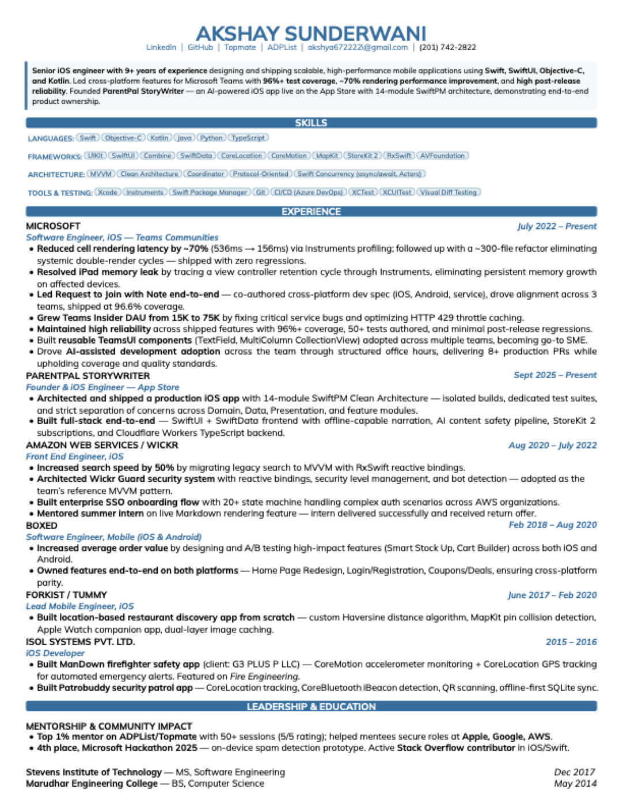

# Typst Resume Template

A clean, professional, single-page resume template built with [Typst](https://typst.app/). Features a summary box, styled skill chips, themed section headers, and tight spacing controls to maximize content on one page.

## Preview

<p align="center">
  
</p>

## Features

- **Summary box** with left-border accent and light fill
- **Skill chips** with themed tag-style badges grouped by category
- **Section headers** with full-width colored background bars
- **Two-column layout** for company name + dates, role titles + subtitles
- **Compact skills section** to maximize space for experience
- **Education grid** supporting inline multi-column layout
- **Customizable theme color** -- change one `rgb()` value to restyle everything
- **Mulish font family** included (no system font dependencies)

## Quick Start

### 1. Install Typst

```bash
# macOS
brew install typst

# Windows
winget install --id Typst.Typst

# Linux
curl -fsSL https://typst.community | sh
```

### 2. Fork & Clone

```bash
# Fork this repo on GitHub, then:
git clone https://github.com/<your-username>/typst-resume-template.git
cd typst-resume-template
```

### 3. Edit Your Resume

Open `resume.typ` and replace the placeholder content with your information:

```typst
#show: project.with(
  theme: rgb("#1A6FA0"),        // Change theme color here
  name: "Your Name",
  contact: (
    contact(text: "LinkedIn", link: "https://linkedin.com/in/you"),
    contact(text: "your@email.com", link: "mailto:your@email.com"),
    contact(text: "(123) 456-7890"),
  ),
  summary: [
    Your professional summary here...
  ],
  skills: (
    ("Languages", ("Swift", "Python", "TypeScript")),
    ("Frameworks", ("React", "Node.js", "SwiftUI")),
  ),
  // ... experience sections
)
```

### 4. Build

```bash
./build.sh
# or directly:
typst compile --font-path ./assets/fonts resume.typ resume.pdf
```

Your PDF will be generated as `resume.pdf`.

## File Structure

```
typst-resume-template/
  template.typ          # Core template (layout, styles, rendering)
  resume.typ            # Your resume content (edit this)
  example-resume.typ    # Full example with real content
  build.sh              # Build script
  assets/
    fonts/              # Mulish font family (bundled)
    preview/            # README preview image
```

## Template API

### Contact

```typst
contact(text: "LinkedIn", link: "https://linkedin.com/in/you")
contact(text: "(123) 456-7890")  // No link = plain text
```

### Section + SubSection

```typst
section(
  title: "Experience",
  content: (
    subSection(
      title: "Company",
      titleEnd: "Jan 2023 - Present",
      subTitle: "Senior Engineer",
      content: list(
        [*Achievement with metric* --- details of what you did.],
      ),
    ),
  ),
)
```

### Skills

```typst
skills: (
  ("Category Label", ("Skill 1", "Skill 2", "Skill 3")),
)
```

### Education (inline grid)

```typst
subSection(
  content: [
    #grid(
      columns: (1fr, auto),
      row-gutter: 4pt,
      [*University* --- MS, Computer Science],
      [_Dec 2022_],
    )
  ],
)
```

## Customization Tips

| What | Where | Default |
|------|-------|---------|
| Theme color | `resume.typ` line `theme: rgb(...)` | `#1A6FA0` |
| Font size | `resume.typ` line `#set text(size: ...)` | `9pt` |
| Page margins | `resume.typ` `margin: (...)` | `9mm` sides, `7mm` bottom |
| Line spacing | `resume.typ` `#set par(leading: ...)` | `0.62em` |
| List spacing | `resume.typ` `#set list(spacing: ...)` | `4.5pt` |
| Skill chip size | `template.typ` `skillChip` function | `0.73em` |
| Section title size | `template.typ` `backgroundTitle` function | `1.05em` |

**Tip**: If your content spills to page 2, reduce `leading`, `spacing`, or `margin` values incrementally. If you have white space at the bottom, increase them.

## Credits

- Template design enhanced from [attractive-typst-resume](https://github.com/iharnoor/attractive-typst-resume) by [iharnoor](https://github.com/iharnoor)
- Built with [Typst](https://typst.app/)
- Font: [Mulish](https://fonts.google.com/specimen/Mulish) (SIL Open Font License)

## License

MIT License -- see [LICENSE](LICENSE) for details. Fork it, make it yours.
