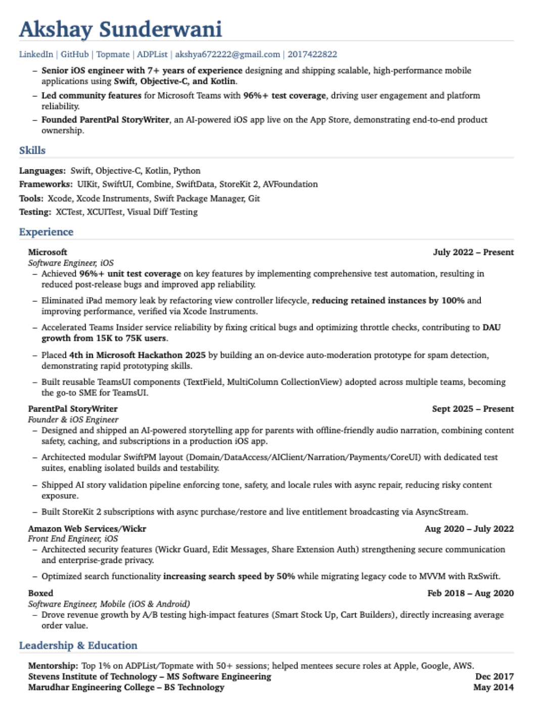
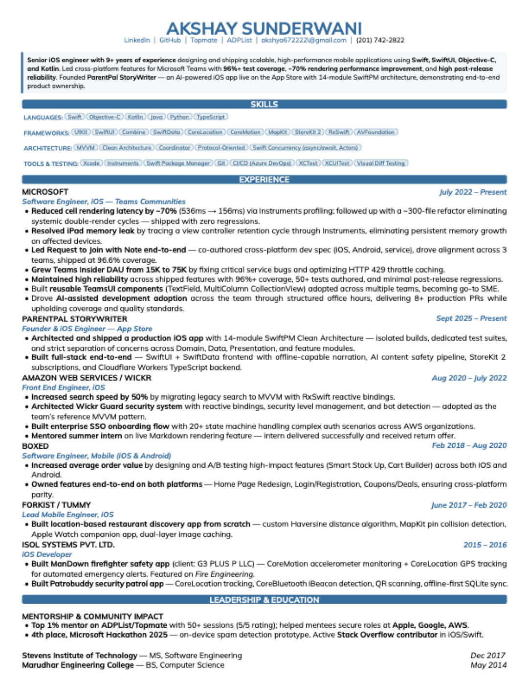

# How I Rebuilt My Resume From a 6.5 to a 9/10 — And Open-Sourced the Template

Most engineers treat their resume like legacy code — it works, so don't touch it. I was the same way. After 9+ years across Microsoft, AWS, Boxed, and shipping my own App Store product, my resume was still a cobbled-together Word doc that undersold almost everything I'd done.

Then I decided to audit it the way I'd audit a codebase: systematically, with metrics, and without mercy.

Here's what I found, what I changed, and the Typst template I built and open-sourced so you can do the same.

But first — here's the before and after:

## Before & After

| Before (6.5/10) | After (9/10) |
|:---:|:---:|
|  |  |

Same person. Same experience. Completely different story.

Now let me break down exactly what changed and why.

---

## The Audit: Rating My Own Resume

I laid my resume next to everything I'd actually shipped — every feature, every metric, every architecture decision — and rated it honestly.

**Score: 6.5/10.**

The content was there, but the presentation was wrong. Here's what was broken:

**1. Volume metrics instead of impact metrics.**
My Boxed section bragged about "1,000+ commits." That's volume, not quality. Nobody cares how many times you hit the save button. What matters is what shipped and what changed because of it.

**2. Absolute claims that invited skepticism.**
"Zero post-release bugs" sounds great until a hiring manager thinks: really? Zero? Ever? Absolute claims don't build trust — they erode it.

**3. Vanity numbers that missed the point.**
I had "28,800 lines of code across 164 files" for my side project. That tells you I typed a lot. It says nothing about architecture, adoption, or reliability — the things that actually matter at senior level.

**4. Bullet order that buried the lead.**
My strongest achievement at Microsoft — a ~70% rendering performance improvement — was somewhere in the middle. The first bullet was about test coverage. Coverage is important, but it's not the thing that makes someone stop scrolling.

**5. Missing roles entirely.**
Three of my earlier positions weren't even on the resume. That's 3+ years of experience just absent from the story.

---

## The Rewrite: Seven Specific Changes

I didn't rewrite everything. I made seven targeted changes, each with a clear rationale.

### 1. Replace volume with impact

**Before:** "1,000+ commits to the iOS and Android codebases"
**After:** "Owned features end-to-end on both platforms — Home Page Redesign, Login/Registration, Coupons/Deals, ensuring cross-platform parity."

Commits are inputs. Features shipped are outputs. Senior engineers are measured on outputs.

### 2. Soften absolutes into credible claims

**Before:** "Zero post-release bugs"
**After:** "Maintained high reliability across shipped features with 96%+ coverage, 50+ tests authored, and minimal post-release regressions."

This says the same thing but with evidence instead of a claim. The coverage percentage and test count let the reader draw their own conclusion.

### 3. Replace lines-of-code with architecture

**Before:** "28,800 lines of Swift across 164 files"
**After:** "Architected and shipped a production iOS app with 14-module SwiftPM Clean Architecture — isolated builds, dedicated test suites, and strict separation of concerns across Domain, Data, Presentation, and feature modules."

One describes typing. The other describes thinking.

### 4. Lead with your strongest metric

I reordered my Microsoft bullets so the first thing you read is:

> "Reduced cell rendering latency by ~70% (536ms → 156ms) via Instruments profiling; followed up with a ~300-file refactor eliminating systemic double-render cycles — shipped with zero regressions."

Performance wins are universal. Every engineering manager understands what a 70% latency reduction means for users.

### 5. Split compound achievements

I had one bullet that combined a rendering fix and a major refactor. The refactor was its own story — ~300 files, shipped with zero regressions over two weeks. Combining them diluted both. I merged them carefully into a single bullet but made sure the refactor's outcome (zero regressions) was explicitly called out.

### 6. Tighten trendy language

**Before:** "AI-first workflows"
**After:** "AI-assisted development adoption across the team through structured office hours, delivering 8+ production PRs while upholding coverage and quality standards."

"AI-first" is a buzzword. "8+ production PRs while upholding coverage" is a result.

### 7. Add the missing story

I added my earlier roles — ISOL Systems (ManDown firefighter safety app, Patrobuddy security patrol), Forkist (location-based discovery from scratch), and properly expanded Boxed and Wickr. Each one added a unique signal: safety-critical mobile, location services, cross-platform ownership, security architecture.

---

## The Template: Why Typst, Not LaTeX or Word

After fixing the content, I rebuilt the presentation layer. I chose [Typst](https://typst.app/) over LaTeX for the same reason I'd choose SwiftUI over UIKit for a new project — it's modern, readable, and compiles in milliseconds instead of seconds.

The template has:

- **Summary box** with a left-border accent — your pitch in 3 sentences
- **Skill chips** — themed tag-style badges that look clean without taking much space
- **Full-width section headers** — colored bars that create clear visual hierarchy
- **Compact skills, spacious experience** — skills are compressed to give your bullets room to breathe
- **One theme color** — change one `rgb()` value and everything updates

The biggest challenge was fitting everything on one page. I went through multiple iterations — adjusting margins (7mm → 9mm), leading (0.4em → 0.62em), list spacing (1.5pt → 4.5pt), and skill chip padding until the content filled the page evenly without cramping or spilling.

It's the same iterative process as performance optimization: measure, adjust, measure again.

**The template is open-source:** [github.com/akshya672222/typst-resume-template](https://github.com/akshya672222/typst-resume-template)

Fork it, replace the placeholder content, run `./build.sh`, and you have a PDF.

---

## The Result

Here's what changed at a glance:

| | Before | After |
|---|---|---|
| **Years of experience** | 7+ | 9+ |
| **Roles listed** | 4 | 7 |
| **Microsoft bullets** | 5 (coverage-first) | 7 (performance-first) |
| **Strongest metric position** | Buried in middle | First bullet |
| **ParentPal framing** | Activity-based (4 bullets) | Architecture-focused (2 tight bullets) |
| **Wickr/AWS** | 2 generic bullets | 4 result-first bullets |
| **Boxed** | 1 bullet, no specifics | 2 bullets with feature names |
| **Forkist/Tummy** | Missing entirely | Added with tech depth |
| **ISOL Systems** | Missing entirely | Added (ManDown + Patrobuddy) |
| **Skills** | Plain text list | Themed skill chips by category |
| **Visual design** | Basic LaTeX | Custom Typst with summary box, section bars |

The same experience, reframed:

- Every bullet leads with a result, not an activity
- Metrics are specific but not absolute
- Architecture and impact replace volume and vanity
- The visual design is clean, professional, and fits on exactly one page

The score went from 6.5 to what I'd now call a 9. Not a 10 — a resume is never done. It evolves with every role, every shipped feature, and every lesson learned.

---

## What I'd Tell Other Engineers

**Audit your resume against your actual work, not your memory of it.** I found three missing roles and a dozen undersold achievements by going through my projects one by one. Your memory compresses things. The evidence doesn't.

**Write result-first, not activity-first.** Start every bullet with the outcome. "Reduced latency by 70%" hits harder than "Worked on performance optimization."

**Kill your darlings.** That commit count you're proud of? That lines-of-code metric? If it doesn't tell a senior-level story, cut it. Replace it with something that shows judgment, not just output.

**Invest in the presentation layer.** Your resume is a product. It has users (recruiters, hiring managers), it has a UX (scannability, hierarchy), and it ships (as a PDF). Treat it accordingly.

---

*The Typst template is MIT-licensed and available at [github.com/akshya672222/typst-resume-template](https://github.com/akshya672222/typst-resume-template). Fork it, make it yours.*

*If you found this useful, I mentor engineers on resume writing, interview prep, and career growth through [Topmate](https://topmate.io/akshay_sunderwani) and [ADPList](https://adplist.org/mentors/akshay-sunderwani).*

---

#Resume #SoftwareEngineering #iOSDev #CareerGrowth #Typst #OpenSource #TechCareers
